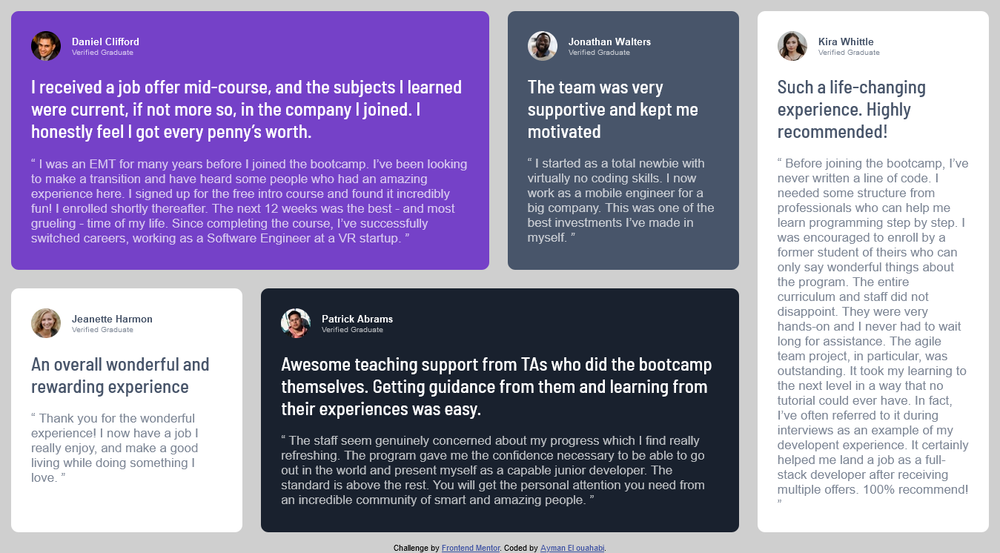

# Frontend Mentor - Intro section with dropdown navigation solution

This is a solution to the [Testimonials grid section](https://www.frontendmentor.io/challenges/testimonials-grid-section-Nnw6J7Un7). Frontend Mentor challenges help you improve your coding skills by building realistic projects. 

## Table of contents

- [Overview](#overview)
  - [The challenge](#the-challenge)
  - [Screenshot](#screenshot)
  - [Links](#links)
- [My process](#my-process)
  - [Built with](#built-with)
- [Author](#author)

## Overview

### The challenge

Users should be able to:

- View the optimal layout for the site depending on their device's screen size

### Screenshot

### Links

- Solution URL: [https://github.com/aymanobi/Testimonials-grid-section-main](https://github.com/aymanobi/Testimonials-grid-section-main)
- Live Site URL: [https://jade-haupia-820525.netlify.app/](https://jade-haupia-820525.netlify.app/)

## My process

### Built with

- Semantic HTML5 markup
- GRID
  
## Author

- Website - [Ayman El Ouahabi](https://aymanel.netlify.app)
- Frontend Mentor - [@aymanobi](https://www.frontendmentor.io/profile/aymanobi)
